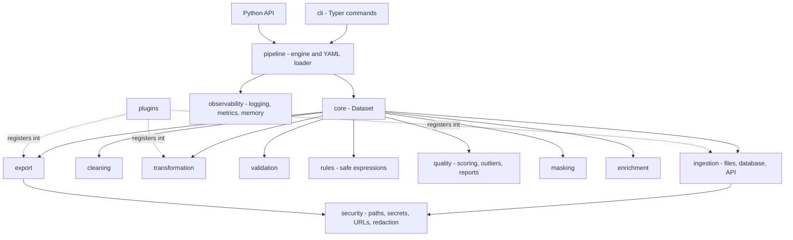
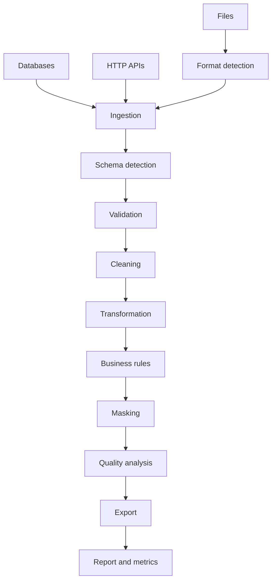

# Architecture

## Layers

The package is organised by responsibility, and the dependency arrows only ever
point inwards: `core` knows nothing about readers, writers or the CLI.



## Data flow



## Key decisions

### `Dataset` is immutable

Every operation returns a new `Dataset` that carries the operation history:

```python
cleaned = raw.clean(missing_values="median").remove_duplicates()
cleaned.history[-1]   # {'operation': 'remove_duplicates', 'rows_removed': 24, ...}
```

The cost is one shallow copy per step. What it buys:

* a failing step cannot leave the input in a half-modified state, so a pipeline
  can skip it and carry on;
* the history is a truthful record of what produced the output, which is what
  goes into the report;
* nothing surprising happens to a frame a caller still holds a reference to.

### Registries instead of `if` chains

Readers, writers and transformations are looked up by name in a registry. Adding
a format means registering a class, not editing a dispatch function, and that is
the same mechanism plugins use.

```python
@register_reader
class AvroReader(Reader):
    format = FileFormat.AVRO
    extensions = (".avro",)
    def read(self, source, **options): ...
```

### Expressions are parsed, not evaluated

`filter`, `create_column` and every business rule accept a short expression.
Those come from YAML, so `eval` and `DataFrame.query` are both out: they execute
arbitrary Python. `SafeExpression` parses with `ast` and walks an explicit
allow-list of node types; attribute access, subscripting, comprehensions,
lambdas and imports are rejected before anything is evaluated.

Evaluation is vectorised - names resolve to pandas Series - so a rule over a
million rows is one pass per operator rather than a Python loop.

### Security lives at the boundaries

Paths, URLs, SQL identifiers and secrets are validated where they enter the
system (`security/`), not sprinkled through the business logic. See
[security.md](security.md).

## Design patterns actually used

| Pattern | Where | Problem it solves |
| --- | --- | --- |
| Strategy | `MissingStrategy`, `Masker`, `AuthStrategy`, `Paginator` | Interchangeable algorithms selected at runtime from configuration |
| Factory / Registry | `ReaderRegistry`, `WriterRegistry`, `TransformationRegistry` | Extending the toolkit without modifying it |
| Adapter | `Reader`, `Writer`, `DatabaseExporter` | One interface over CSV, Parquet, Excel, SQL, HTTP |
| Pipeline | `Pipeline`, `TransformationChain` | Composing steps with shared metrics and error handling |
| Builder | `Pipeline.read().clean().validate().write()` | Readable construction of a multi-step run |
| Repository | `DatabaseClient` | Query and persistence behind a testable seam |
| Dependency injection | `PathPolicy`, `URLPolicy`, `MetricsSink`, `requests.Session` | Swapping policies in tests without patching globals |

Patterns that did not solve a real problem here were left out: there is no
abstract factory over the registries and no observer over the metrics, because a
single sink interface covers every case the toolkit has.

## Directory layout

```text
src/universal_data/
  core/           Dataset, exceptions, shared enums
  security/       path policy, secrets, URL policy, log redaction
  ingestion/      format detection, file readers, database client, API client
  schema/         schema model, inference, YAML loading
  validation/     column checks and the schema validator
  cleaning/       cleaning operations and the cleaning engine
  transformation/ transformation interface, built-ins, registry
  rules/          safe expression engine and the business rule engine
  quality/        quality scoring, outliers, HTML/JSON reports
  enrichment/     lookups, mappings, derived columns, external services
  masking/        PII masking strategies and policies
  export/         writer interface and the built-in writers
  inspection/     dataset and column profiling
  pipeline/       pipeline engine and the YAML configuration loader
  observability/  structured logging, metrics, memory accounting
  plugins/        entry-point discovery
  generator/      synthetic data with configurable defects
  cli/            Typer application and benchmarks
```
